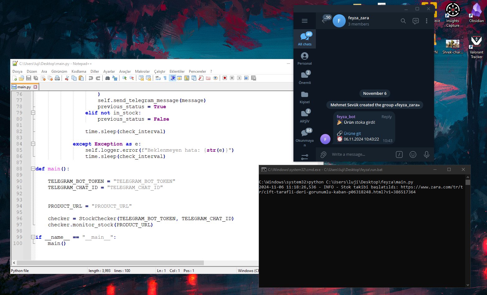
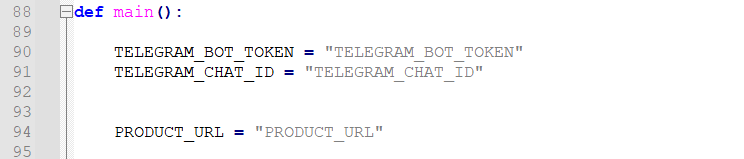

# Zara Stock Checker

Ürünün stokta olma durumunda telegram üzerinden mesaj gönderen bir python scripti.

## Ekran Görüntüleri


### Değişmesi gereken yerler


## Yapılacak veya yapmaya üşeneceğim
- Henüz Telegram bot nasıl oluşturursunuz bunu anlatmadım ama üşenmezsem bu repoyu güncelleyebilirim
- Her seferinde Windows üzerinde açmaya üşeniyorsanız Task Scheduler ile her oturum açıldığında otomatik açılmasını sağlayabilirsiniz.

## Kurulum


1. Repoyu klonlayın:
   ```bash
   git clone https://github.com/lujiangz/Zara-Stock-Checker.git

2. Gerekli şeyleri yükleyin
	```bash
	pip install -r requirements.txt

3. Çalıştır
	```bash
	python main.py
